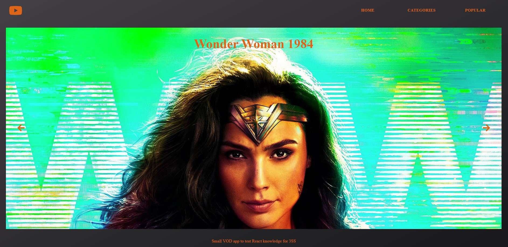
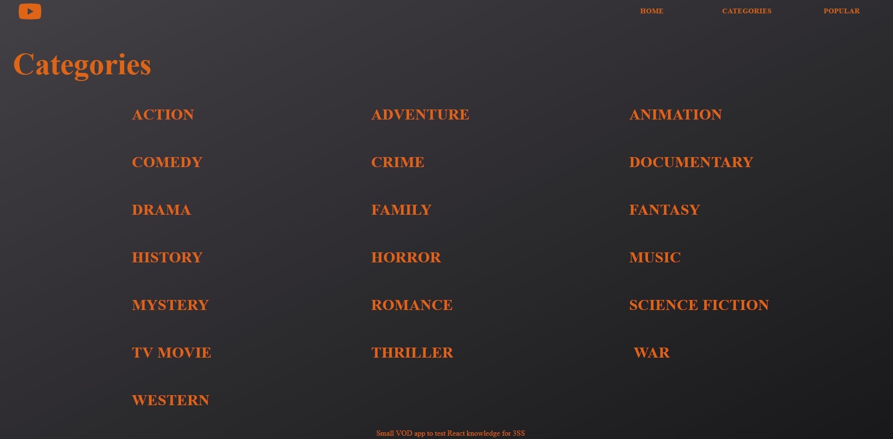
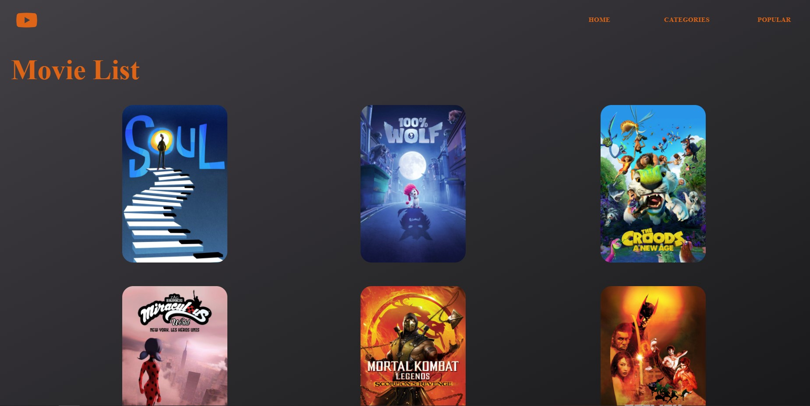
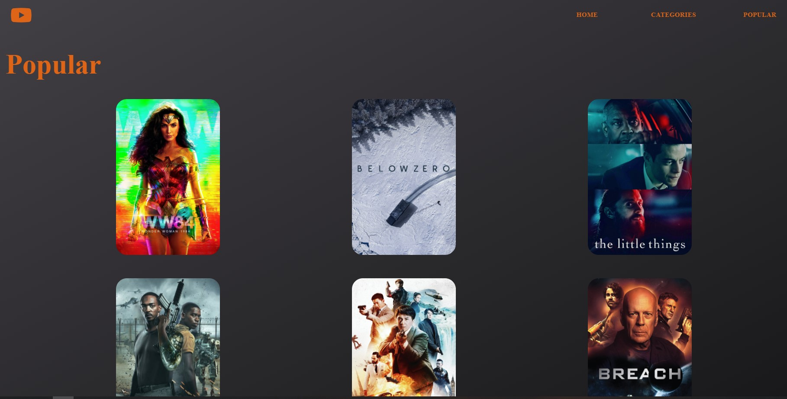
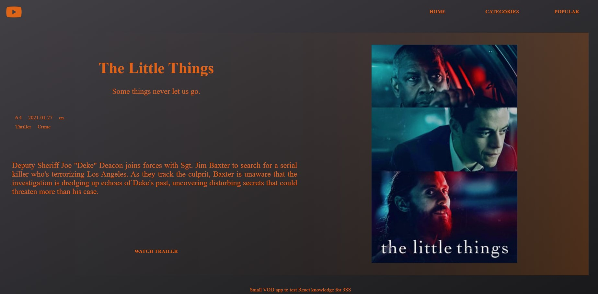
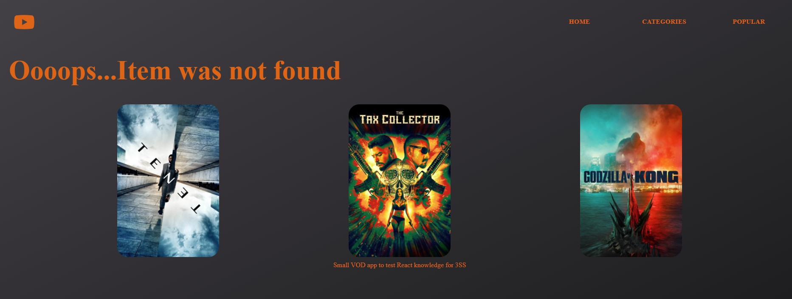

# Play'EM
A small VOD app.

# Inspiration
I created a VOD app to further develop my skills with ReactJs.

The app architecture/structure is mostly based on the following criterias:
+ Menu in the header on each page.
+ Each cover leads to AssetDetails page.
+ The project has the following page components:
    + __Home__
        - Route: '/' or ''
        - Content: carousel/slider from the popular assets.
    + __Categories__
        - Route: '/categories'
        - Content: a grid of categories, use Get categories API call. Clicking on any category element should take you to "MoviesByCategory" page
    + __MoviesByCategory__
        - Route: '/movies/:category_id'
        - Content: a grid of movies using Get assets by category API call. The API returns 20 elements by a call so I implemented lazy loading when the bottom of the page has been reached.
    + __AssetDetails__
        - Route: '/asset/:id'
        - Content:
            - basic information about the asset, images etc
            - "Watch Trailers" button which will show the youtube player inside a modal.
    + __Popular__
        - Route: '/popular'
        - Content: grid of popular assets
    + __Not found (404)__
        - Route: '*'
        - Content: a not found message + the last 3 elements from the popular movie list

# Development stack
+ [React.js](https://reactjs.org/)
+ [React Context](https://reactjs.org/docs/context.html)
+ I used React Functional Components to style the project.
+ The API uses [TheMovieDB](https://www.themoviedb.org/).

# APIs
+ TheMovieDB (https://www.themoviedb.org/)

# External packages
+ [styled-components]

# Current progress
- [x] App design
- [x] Basic UI prototype
- [X] Create main page
- [X] Create components from main page
- [X] Design and create hard code copy template of the project
- [X] Implement React Context
- [X] Bring data from external source
- [X] Remove extra code and fix typos or bugs
- [ ] ...

# Running

## Clone & install

+ Clone this repo `git@github.com:dieterhalosta/play-em.git`
+ `cd play-em`
+ run `npm install` or `yarn`
+ run `yarn start`

## License

Released under the [MIT License](http://opensource.org/licenses/MIT).

# Feedback

Feedback is always welcome. Feel free to contact me, I would love to know if you notice something that can be done better.